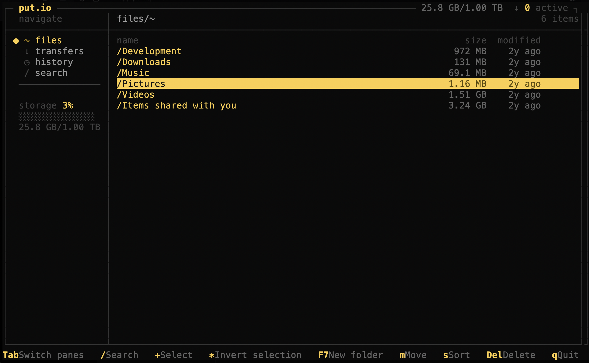

# putio-tui

A terminal UI client for [put.io](https://put.io).



## Install

### macOS (Homebrew)

```
brew install hafifuyku/putio-tui/putio-tui
```

### Linux / macOS (pip)

```
pipx install git+https://github.com/hafifuyku/putio-tui.git
```

Or with pip:

```
pip install git+https://github.com/hafifuyku/putio-tui.git
```

## Usage

```
putio-tui
```

On first run, your browser will open to log in to put.io. The token is saved to `~/.config/putio-tui/token` automatically.

## Keys

| Key | Action |
|-----|--------|
| `j` / `k` / arrows | Navigate |
| `Enter` / `Right` | Open folder or play file in VLC |
| `Left` / `Backspace` | Go back |
| `Tab` | Switch between sidebar and file list |
| `+` / `Space` | Mark/unmark file |
| `*` | Invert selection |
| `m` / `F6` | Move selected files |
| `F7` | Create new folder |
| `D` / `Del` / `F8` | Delete |
| `s` | Sort |
| `/` | Search |
| `a` | Add transfer (magnet/URL) |
| `c` | Cancel transfer |
| `o` | Clear completed transfers |
| `g` / `G` | Jump to top/bottom |
| `PgUp` / `PgDn` | Page up/down |
| `1` `2` `3` | Switch to files/transfers/history |
| `q` / `F10` | Quit |

## Build from source

Requires Python 3.11+.

```
# Run directly
pip install textual rich
python app.py

# Build standalone binary
pip install pyinstaller
pyinstaller --onefile --name putio-tui app.py
# Binary will be in dist/putio-tui
```
